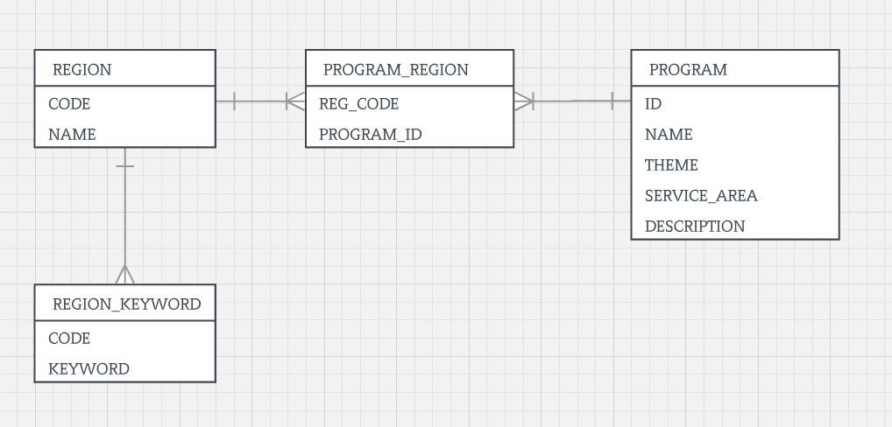

# 생태 정보 서비스 API개발
대한민국 지역기반 생태 관광 정보 서비스

## Development Stack
- Spring Boot 2.1.2
- Spring Data JPA + QueryDsl
- Lombok 
- Mapstruct
- H2 Database
- JUnit5, Mockito2

## How to build
Use __Gradle__ and __Java 8 or later__ to build tourism

```
# Build project
$ ./gradlew build

# Run project
$ java -jar build/libs/tour-0.0.1-SNAPSHOT.jar
```

## Solving
### ERD
- 프로그램은 여러 지역에 속해 있을 수 있음. 
- 지역은 여러 키워드로 조회될 수 있음. 
- 지역에 관한 키워드를 관리하고 프로그램의 서비스 지역 코드를 추출해서 지역과 맵핑


### 선작업
- 서비스 지역은 서비스 지역을 선별하여 2level(시구군) 까지만 저장. 
> 초기에 프로그래명의 서비스 지역을 프로그램 추가시 정규표현식으로 분리하여 자동 생성되게 하려 했으나
> 지역 자체를 프로그래밍적으로 추출하기 보다 샘플로 제공된 선별지역을 생성함 

### 구현
1. 생태 관광 정보 데이터 저장/수정/삭제
> ProgramRestController 

2. 서비스 지역 코드 기준으로 생태 관광 정보 데이터 검색
> TourRestController.getRegionPrograms 

3. 특정 서비스 지역에서 진행되는 프로그래명과 테마를 출력
> TourRestController.getProgramNameAndTheme 

4. 생태 관광 정보 데이터에 프로그램 소개 컬럼에서 특정 문자열이 포함된 레코드에서 서비스 지역 개수 출력
> TourRestController.getRegionAndCount

5. 모든 생태 관광 정보 데이터의 프로그램 상세 정보를 읽어와서 입력 단어의 출현 빈도수 출력
> TourRestController.getKeywordCount

6. 지역명과 키워드를 입력받아 생태관광 프로그램 추천
> TourRestController.getRecommendProgram

#### sample
```
src/integraiton-test/java/org/uhafactory/tour/api/TourRestControllerIntegrationTest
```